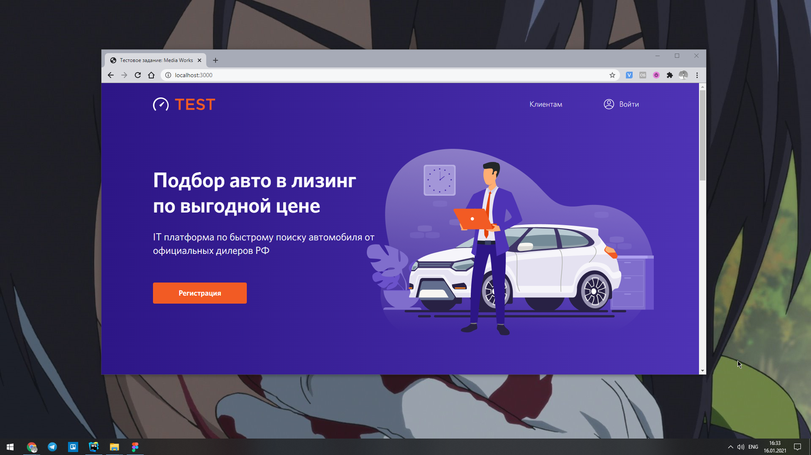

# Тестовое задание на верстку от [Media Works](https://mworks.ru/)

[Демо](https://greatstudentkaze.ru/test-media-works/)

---

## Описание
Необходимо сверстать макет страницы по методологии БЭМ и сделать адаптив.\
Использовать препроцессор SCSS.\
При нажатии на кнопку Войти должна открываться форма авторизации.

## Ссылки
* [Макет в фигме](https://www.figma.com/file/zTzATxQojcX5hO0sr5jzel/Test-Landing)
* [Ссылка на шрифт](https://webfonts.pro/base-web-fonts/sans-serif-grotesque/898-whitney.html)

---

## Как использовать

Клонирование репозитория:\
`git clone git@github.com:greatstudentkaze/test-media-works.git`

Установка зависимостей:\
`npm install`

Сборка проекта в режиме разработки и запуск локального сервера:\
`npm start`

Сборка в продакшн:\
`npm run build` 

---

## В проекте используется

* Gulp
* SCSS
* БЭМ

